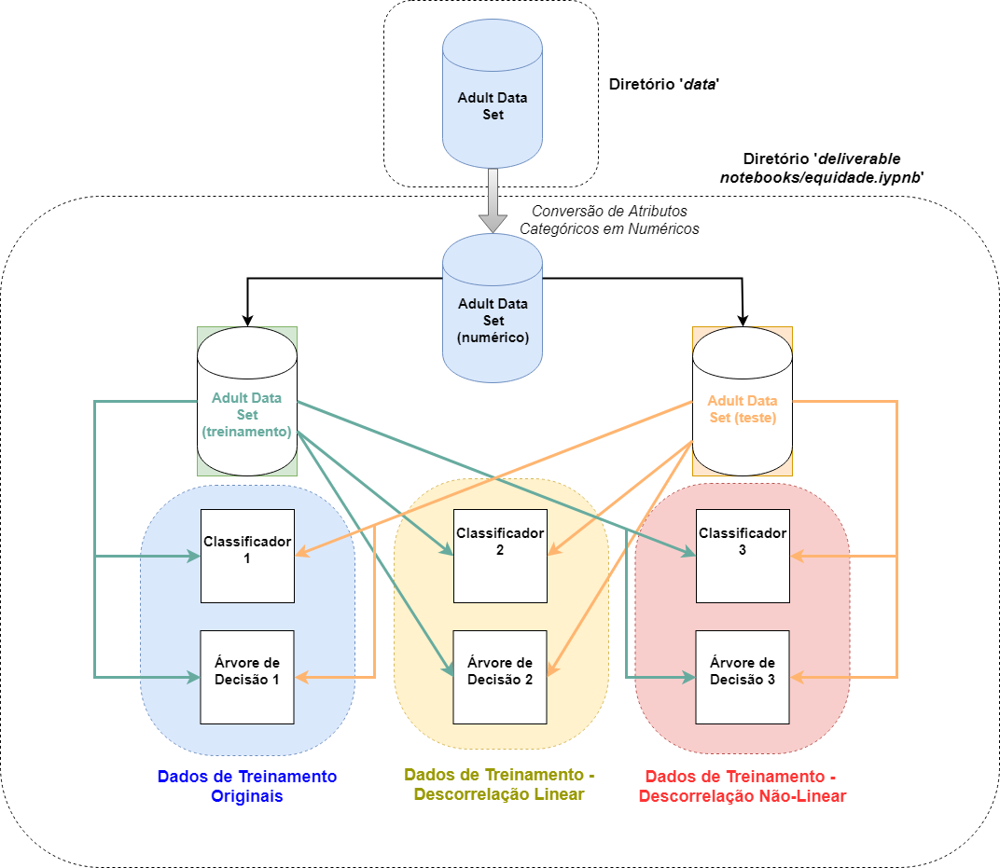

# Equidade em Aprendizado de Máquina

## Introdução

Este repositório contém o paper executável referente ao trabalho "Equidade em Aprendizado de Máquina". No referido trabalho, buscamos promover a equidade aplicando as técnicas de ICA sobre o atributo discriminatório (Gênero) e as classes do problema (Alta Renda e Baixa Renda).

Ao todo, estudamos 6 classificadores neste trabalho: 3 classificadores baseados em regressão logística e 3 baseados em árvores de decisão. Ilustramos a seguir o nosso *Workflow* de trabalho.

## Paper Executável

A versão final do paper executável se encontra na pasta "deliverable notebooks", arquivo "Equidade-paper-2c.pdf", assim como o notebook final "equidade.ipynb".

Na sequência são apresentadas as instruções para a execução do paper.

Como sugestão, procure tentar reproduzir o paper primeiro via Docker; caso não seja possível, tente instalar os pacotes via Anaconda, conforme as instruções abaixo; em último caso, busque ajustar o ambiente via pip.

## Execução via Docker

Tutorial de Instalação do Docker: https://www.digitalocean.com/community/tutorials/como-instalar-e-usar-o-docker-no-ubuntu-16-04-pt

### Maneira 1: A partir da imagem disponível no DockerHub

A imagem disponibilizada se encontrar no DockerHub: https://cloud.docker.com/repository/docker/renanbrotto/imagem-equidade

1) Com o Docker instalado, execute o seguinte comando no terminal: sudo docker run -p 8888:8888 renanbrotto/imagem-equidade
2) Após instalar todas as dependências listadas em requirements.txt, aparecerá a seguinte mensagem no terminal:

 *To access the notebook, open this file in a browser:
        file:///home/jovyan/.local/share/jupyter/runtime/nbserver-8-open.html*     
        
        
 *Or copy and paste one of these URLs: http://(69d14d731a14 or 127.0.0.1):8888/?token=11e6175d2d69cd2b8c4fb93396612a256e733449fc984a23*

3) Após colar uma das URLs acima no navegador da máquina local (para o exemplo acima, teríamos o seguinte endereço na barra de navegação:  127.0.0.1:8888/?token=11e6175d2d69cd2b8c4fb93396612a256e733449fc984a23) o Jupyter será aberto automaticamente em seu navegador
4) Navegue até a pasta "deliverable notebooks" e execute o arquivo "equidade.ipynb"
5) Com o notebook aberto, vá até a aba "Cell" e clique em "Run All"
6) Todas as figuras produzidas serão salvas na pasta "fig" que se encontra na raiz do diretório 

### Maneira 2: A partir do Dockerfile

1) Clonar o repositório
2) Navegar até a pasta do paper executável (<caminho>./ia369-reprodutibilidade-cientifica-master)
3) Executar o comando: sudo docker build --tag=imagem-equidade . 
4) Executar o comando: sudo docker run -p 8888:8888 imagem-equidade
5) Após instalar todas as dependências listadas em requirements.txt, aparecerá a seguinte mensagem no terminal:

 *To access the notebook, open this file in a browser:
        file:///home/jovyan/.local/share/jupyter/runtime/nbserver-8-open.html*     
        
        
 *Or copy and paste one of these URLs: http://(69d14d731a14 or 127.0.0.1):8888/?token=11e6175d2d69cd2b8c4fb93396612a256e733449fc984a23*

6) Após colar uma das URLs acima no navegador da máquina local (para o exemplo acima, teríamos o seguinte endereço na barra de navegação:  127.0.0.1:8888/?token=11e6175d2d69cd2b8c4fb93396612a256e733449fc984a23) o Jupyter será aberto automaticamente em seu navegador
7) Navegue até a pasta "deliverable notebooks" e execute o arquivo "equidade.ipynb"
8) Com o notebook aberto, vá até a aba "Cell" e clique em "Run All"
9) Todas as figuras produzidas serão salvas na pasta "fig" que se encontra na raiz do diretório 

## Execução via Anaconda ou Pip 

Para a execução do paper, é recomendada a instalação do ambiente Anaconda

**Tutorial de Instalação para Linux**: https://docs.anaconda.com/anaconda/install/linux/

**Tutorial de Instalação para Windows**: https://docs.anaconda.com/anaconda/install/windows/

E também do Jupyter Notebook. Para usuários de **Windowns**, o Jupyter Notebook será instalado juntamente com o ambiente Anaconda. 

Para usuários de **Linux (Ubuntu 16.04)** basta seguir o tutorial disponível em https://www.rosehosting.com/blog/how-to-install-jupyter-on-an-ubuntu-16-04-vps/

O notebook *equidade.ipynb* necessita ainda das seguintes bibliotecas: scikit-learn, pandas e seaborn. Essas três bibliotecas podem ser instaladas pelo *Anaconda Navigator*:

1. Com o _Anaconda Navigator_ aberto, acesse a aba _Environments_ e selecione o abiente de trabalho. 
2. Marque a opção _All_ na barra de opçoes na parte superior, à esquerda e coloque o nome do pacote na aba de buscas. 
3. Selecione o pacote de interesse e clique na opção _Apply_, na parte inferior direita do navegador.

Como alternativa, todas essas bibliotecas podem ser instaladas pelo comando _pip_:

1. sudo pip install -U scikit-learn
2. sudo pip install pandas
3. sudo pip install seaborn

Além disso, é necessário instalar mais duas bibliotecas para a execução completa deste notebook: GraphViz e PydotPlus.

**Windows**: baixar o assistente de instalação *graphviz-2.38.msi* em https://graphviz.gitlab.io/_pages/Download/Download_windows.html.
Feita a instalação, deve-se adicionar o diretório de instalação a PATH do sistema:

1. Acessar o Painel de Controle
2. Sistema e Segurança
3. Sistema
4. Configurações Avançadas de Sistema
5. Na aba "Avançado" entrar em _Variáveis de Ambiente_
6. Selecionar "PATH" e clicar em Editar
7. Inserir um ";" (ponto-e-vírgula) ao final do valor da variável e adicionar o diretório de instalação: C:\Program Files (x86)\Graphviz2.38\bin

**Linux (Ubuntu 16.04)**: No terminal, executar os seguintes comandos:

1. sudo apt-get install graphviz
2. sudo apt-get install python-pydot

Concluída a instalação, é necessário clonar ou baixar esse repositório para a máquina local.

Tendo acesso local ao repositório, entre na pasta *deliverable notebooks*. Pela linha de comando, faça os seguintes passos:

1. Acesse o local onde foi feito o download do repositório e entre na pasta *deliverable notebooks*.
2. Execute o comando: jupyter equidade.ipynb

Pelo *Anaconda Navigator*:

1. Navegue pelas pastas até onde o repositório foi clonado. Acesse a pasta *deliverable notebooks*.
2. Selecione o arquivo *equidade.ipynb*

